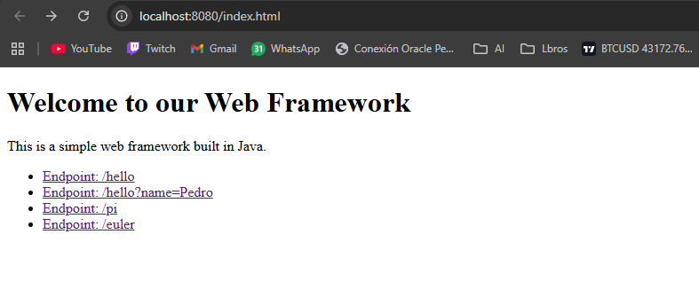
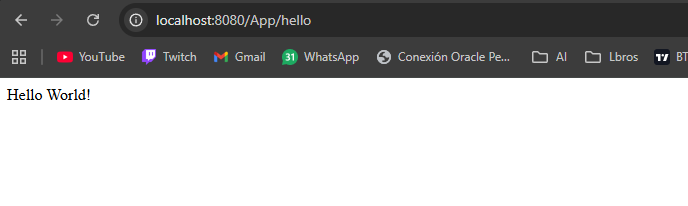
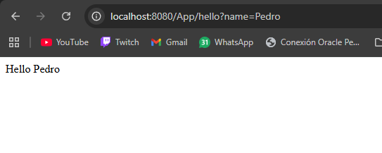
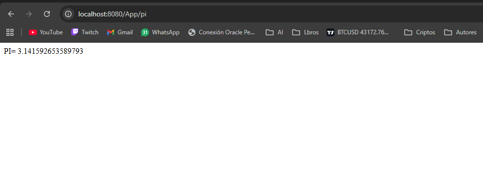
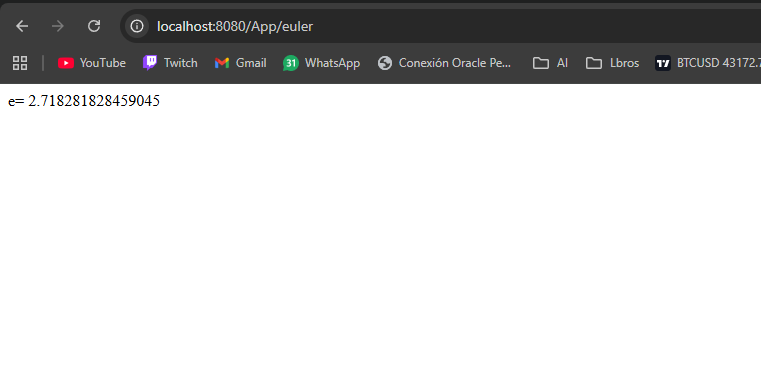
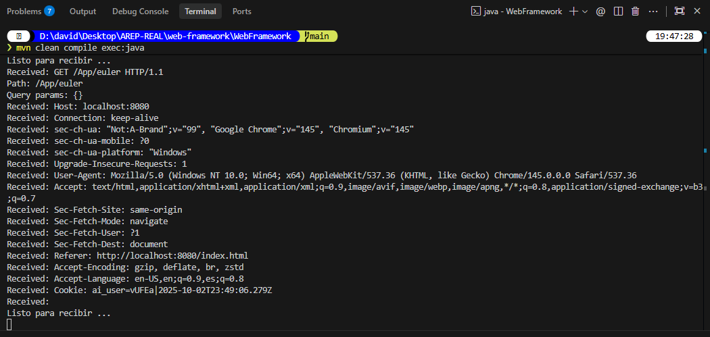

# Web Framework for REST Services and Static Files

## Description
This project is a lightweight web framework built in Java that enables rapid development of web applications with REST services. The framework provides an intuitive API for defining endpoints using lambda expressions, handling query parameters, and serving static files.

## Features

### 1. GET Static Method for REST Services
Implement a `get()` method that allows developers to define REST services using lambda functions.

**Example Usage:**
```java
get("/hello", (req, res) -> "hello world!");
```
This feature enables developers to define simple and clear routes within their applications, mapping URLs to specific lambda expressions that handle the requests and responses.

### 2. Query Value Extraction Mechanism
Develop a mechanism to extract query parameters from incoming requests and make them accessible within the REST services.

**Example Usage:**
```java
get("/hello", (req, res) -> "hello " + req.getValues("name"));
```
This functionality facilitates the creation of dynamic and parameterized REST services, allowing developers to easily access and utilize query parameters within their service implementations.

### 3. Static File Location Specification
Introduce a `staticfiles()` method that allows developers to define the folder where static files are located.

**Example Usage:**
```java
staticfiles("webroot/public");
```
The framework will then look for static files in the specified directory, such as `target/classes/webroot/public`, making it easier for developers to organize and manage their application's static resources.

## Architecture

The framework is built on Java's core networking libraries and follows a simple yet effective architectural design:

### Core Components

1. **HttpServer**: Main server component that listens on port 8080 and handles incoming HTTP requests. Uses `ServerSocket` for TCP connections and manages request/response lifecycle.

2. **HttpRequest**: Encapsulates HTTP request data, including query parameters extracted from the URL. Provides the `getValues()` method to access query parameter values.

3. **HttpResponse**: Represents the HTTP response (currently minimal, prepared for future enhancements).

4. **WebMethod**: Functional interface that enables lambda expressions for route handlers. Allows developers to define endpoints with simple lambda syntax.

5. **Routing System**: Uses a `HashMap<String, WebMethod>` to map URL paths to their corresponding handler functions (lambdas).

6. **Static File Handler**: Reads files from the classpath using `getResourceAsStream()`, detects MIME types based on file extensions, and serves them with appropriate Content-Type headers.

### Request Flow

1. Client sends HTTP request to `http://localhost:8080/path`
2. Server parses the request line and extracts path and query parameters
3. Server checks if path matches a registered REST endpoint:
   - **If yes**: Executes the lambda function and returns the result wrapped in HTML
   - **If no**: Attempts to serve a static file from the configured directory
   - **If neither**: Returns 404 Not Found

This architecture keeps the framework lightweight while providing essential features for web development.

## How to Run

### Prerequisites
- Java 8 or higher
- Maven 3.x

### Steps

1. Clone the repository and navigate to the project directory:
   ```bash
   cd web-framework/WebFramework
   ```

2. Compile the project:
   ```bash
   mvn clean compile
   ```

3. Run the application:
   ```bash
   mvn exec:java
   ```

4. Open your browser and test the endpoints:
   - `http://localhost:8080/App/hello`
   - `http://localhost:8080/App/pi`
   - `http://localhost:8080/index.html`

## Example Usage

Here's a complete example showing how to create a web application using the framework:

```java
public static void main(String[] args) throws IOException, URISyntaxException {
    // Configure static files directory
    HttpServer.staticfiles("/webroot");
    
    // Define REST endpoints with lambdas
    HttpServer.get("/App/hello", (req, res) -> {
        String name = req.getValues("name");
        return name.isEmpty() ? "Hello World!" : "Hello " + name;
    });
    
    HttpServer.get("/App/pi", (req, res) -> "PI = " + Math.PI);
    
    HttpServer.get("/App/euler", (req, res) -> "e = " + Math.E);
    
    // Start the server
    HttpServer.main(args);
}
```

### Available Endpoints

After running the application, these endpoints will be available:

* **REST Services:**
  * `http://localhost:8080/App/hello` - Returns "Hello World!"
  * `http://localhost:8080/App/hello?name=Pedro` - Returns "Hello Pedro"
  * `http://localhost:8080/App/pi` - Returns the value of PI
  * `http://localhost:8080/App/euler` - Returns the value of Euler's number

* **Static Files:**
  * `http://localhost:8080/index.html` - Serves the HTML file from webroot directory

## Test Results

Below are screenshots demonstrating the framework functionality:

**1. Web Framework Overview:**


**2. Hello Endpoint (`/App/hello`):**


**3. Hello Endpoint with Name Query (`/App/hello?name=Pedro`):**


**4. Pi Endpoint (`/App/pi`):**


**5. Euler Endpoint (`/App/euler`):**


**6. Running Framework Console / Process:**



## Author

David Sarria - March 2026